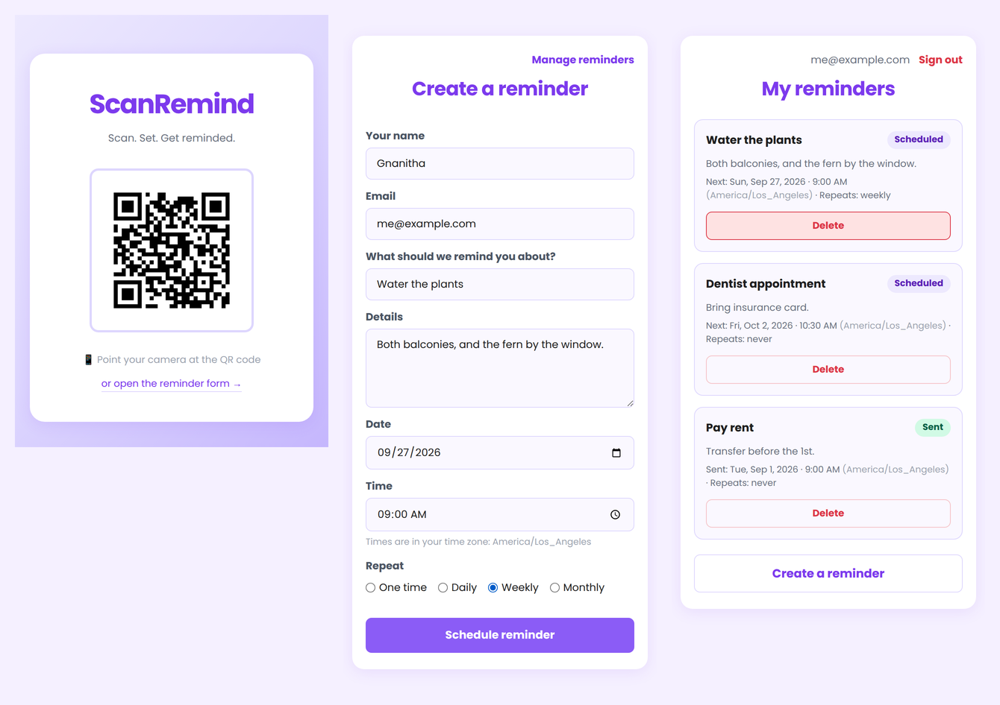
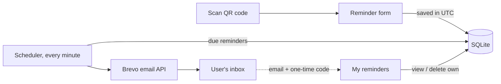

# ScanRemind

[](https://github.com/GnanithaG/ScanRemind-reminder-project/actions/workflows/ci.yml)


**Scan a QR code, set a reminder, get an email when it's due.** No sign-up: people manage their reminders by verifying their email with a one-time code.



## Features

- **QR landing page** that sends people straight to the reminder form
- **One-time, daily, weekly and monthly reminders**, entered in the user's own time zone
- **Time-zone aware repeats**: a "9:00 every day" reminder stays at 9:00 local time across daylight-saving changes
- **Passwordless access** to your reminders with an emailed 6-digit code
- **Reliable delivery**: failed sends are retried with backoff (2, 4, 8, 16 min) and marked *Failed* after 5 tries instead of retrying forever; after downtime, a repeating reminder sends one catch-up email rather than one per missed interval
- **Secure by default**: CSRF protection, hashed one-time codes with attempt limits and rate limiting, owner-only deletes, secure session cookies
- **Runs anywhere**: Docker image, gunicorn config, and a `flask send-due` command for cron-based hosting

## How it works



1. The landing page shows a QR code that links to the reminder form.
2. The form sends the user's browser time zone along with the date and time. The server converts to UTC, validates it, and stores it.
3. A background scheduler checks for due reminders every minute and emails them through Brevo. One-time reminders are marked sent; repeating ones move to their next occurrence.
4. To manage reminders, users request a code by email. After verifying it, they can see and delete reminders sent to that address, and only those.

## Tech stack

Python 3.11+ · Flask 3 · Flask-WTF (CSRF) · SQLite · APScheduler · Brevo transactional email API · Jinja2 · gunicorn · Docker · pytest · Ruff · GitHub Actions

## Getting started

### Run locally

```bash
git clone https://github.com/GnanithaG/ScanRemind-reminder-project.git
cd ScanRemind-reminder-project
python -m venv .venv && source .venv/bin/activate   # Windows: .venv\Scripts\activate
pip install -r requirements-dev.txt
cp .env.example .env        # then set FLASK_SECRET_KEY
python wsgi.py
```

Open http://127.0.0.1:5000. With the default `MAIL_BACKEND=console`, emails (including one-time codes) are printed to the terminal instead of sent, so you don't need an email account to try it.

### Run with Docker

```bash
cp .env.example .env        # set FLASK_SECRET_KEY, MAIL_BACKEND=brevo and the Brevo settings
docker compose up --build
```

The app runs on http://localhost:8000 and keeps its database in a Docker volume.

### Configuration

All settings come from environment variables (see [`.env.example`](.env.example)).

| Variable | Required | Description |
| --- | --- | --- |
| `FLASK_SECRET_KEY` | Yes | Signs sessions and hashes one-time codes. The app refuses to start without it in production. |
| `APP_URL` | No | Where the QR code points. Defaults to this server's `/set-reminder`. |
| `MAIL_BACKEND` | No | `brevo` (default in production) or `console` (default when `FLASK_DEBUG=true`). |
| `BREVO_API_KEY`, `MAIL_SENDER_EMAIL` | With Brevo | Brevo API key and a sender address verified in Brevo. |
| `DATABASE_PATH` | No | SQLite file location. Default `reminders.db`. |
| `SESSION_COOKIE_SECURE` | No | Defaults to `true` outside debug mode; set `false` only for local http. |
| `RUN_SCHEDULER` | No | Set `false` if you trigger delivery from cron with `flask --app wsgi send-due`. |

## Deployment

```bash
gunicorn -c gunicorn.conf.py wsgi:app
```

`gunicorn.conf.py` starts **one** scheduler in the gunicorn master process, so reminders are sent once no matter how many workers run (see [INC-004](docs/PRODUCTION_INCIDENTS.md)). On hosts where background threads get suspended, set `RUN_SCHEDULER=false` and call `flask --app wsgi send-due` from a cron job every minute instead.

Existing databases from earlier versions are upgraded in place on startup. No manual migration is needed.

## Tests

```bash
pytest          # 33 tests: forms, auth, delivery, retries, DST, migrations
ruff check .    # lint
```

CI runs both on Python 3.11 to 3.13 and builds the Docker image on every push and pull request.

## Project structure

```
scanremind/
├── __init__.py        # app factory, error pages, CLI command
├── config.py          # settings from environment variables
├── db.py              # SQLite schema and automatic migrations
├── delivery.py        # finds due reminders, sends them, handles repeats and retries
├── mailer.py          # Brevo and console email backends
├── scheduler.py       # APScheduler job
├── routes/            # qr, reminders, auth (one-time codes) blueprints
├── templates/         # Jinja templates on a shared base layout
└── static/styles.css
tests/                 # pytest suite
wsgi.py                # entry point (python wsgi.py for local dev)
gunicorn.conf.py       # production server + single scheduler
```

## Lessons from production

This app has been deployed and the problems it hit are written up in [docs/PRODUCTION_INCIDENTS.md](docs/PRODUCTION_INCIDENTS.md): tables missing under gunicorn, cloud IPs blocked by Gmail SMTP, duplicate emails from one scheduler per worker, time zone mix-ups, and endless retries. Planned work is in [docs/ROADMAP.md](docs/ROADMAP.md).

## Why I built this

I built ScanRemind to practice full-stack Flask development end to end: database design, QR code generation, background scheduling, and transactional email delivery in a real deployed workflow.
